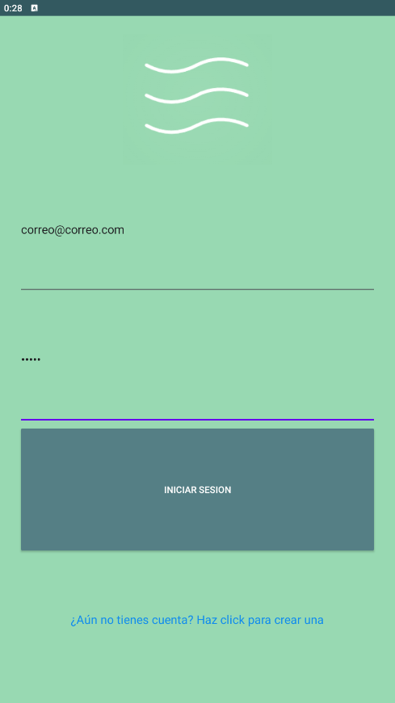
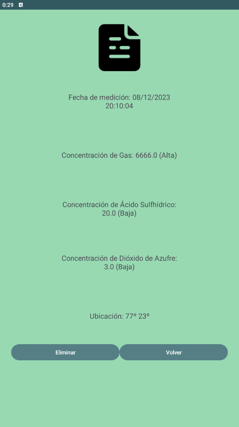

# android-appMediciones

Éste proyecto fue hecho para el ramo de Aplicaciones Móviles IOT.

## Instalación
    
Abrir como proyecto en Android Studio y correr ya sea en emulador o celular.

Se puede crear un usuario o usar:
* User: correo@correo.com
* Pwd: correo

## Tecnologías
* Java
* Firebase
  
## Screenshots : 

